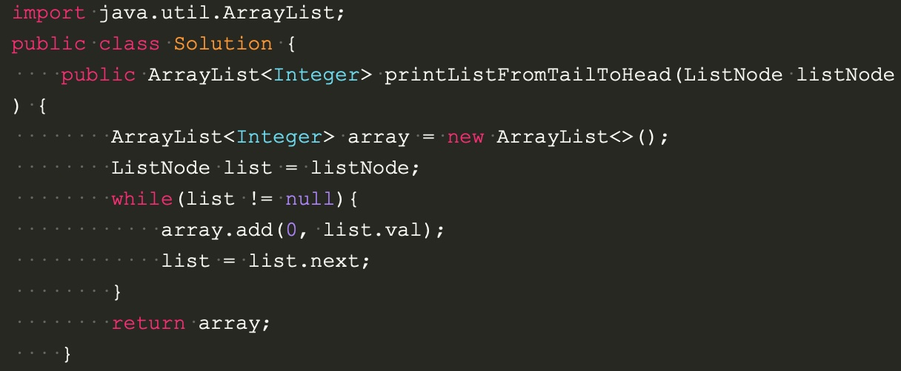

# Return a reversed Linked list as an ArrayList

## Method 1:
Keep add value at the front of array
time complexity: O(n)
space complexity: O(n)

## Method 2:
Recursive
time complexity: O(n)
space complexity: O(n)

# Code

