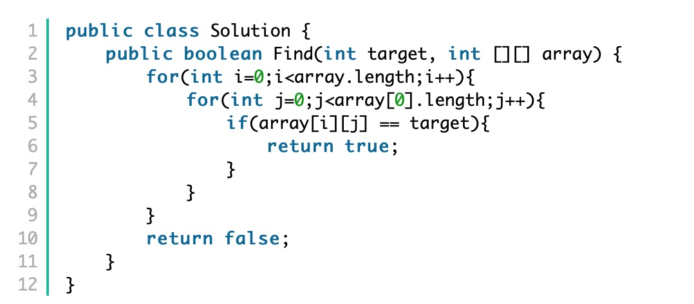
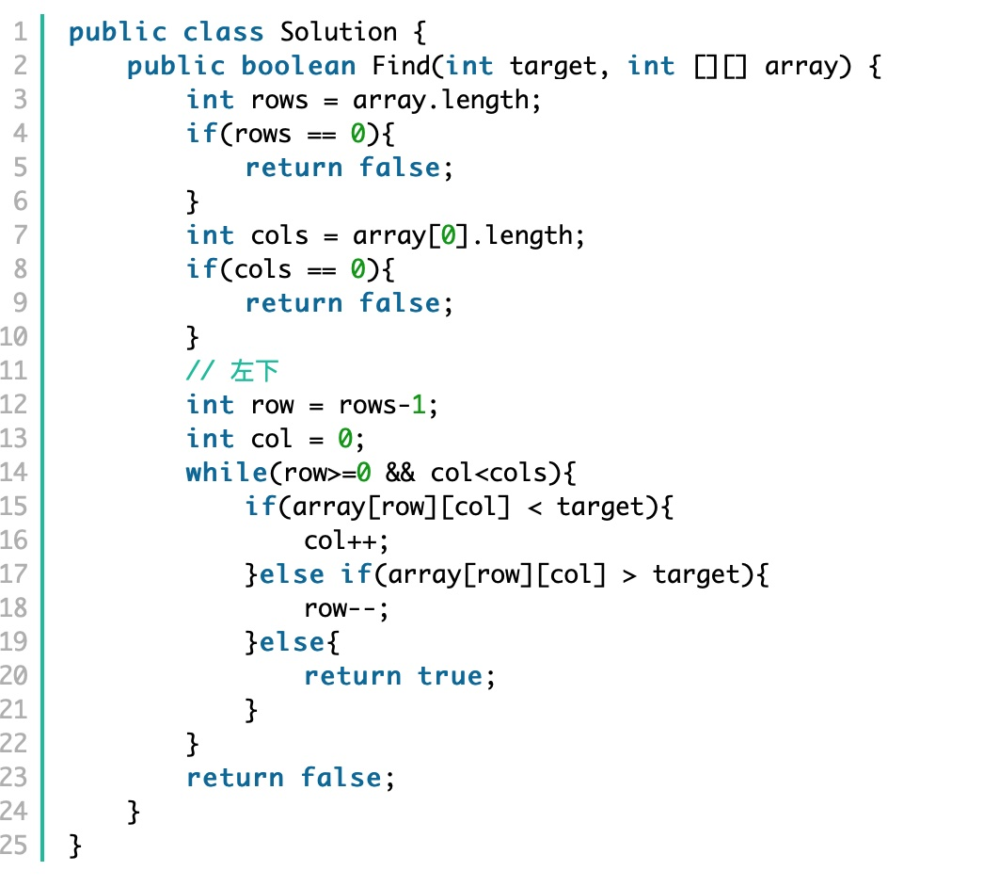

# Search In a 2D Sorted Matrix
There is a 2D array, each row is sorted in ascending order, return true if find the target number in the matrix, otherwise return false.

## Method 1:
Keep finding the target one by one in the matrix return true if find.
time complexity: O(n^2)
space complexity: O(1)

## Method 2:
Find from the left bottom corner or from the right top corner.
time complexity: O(max (m,n)) m=height, m=width
space complexity: O(1)

