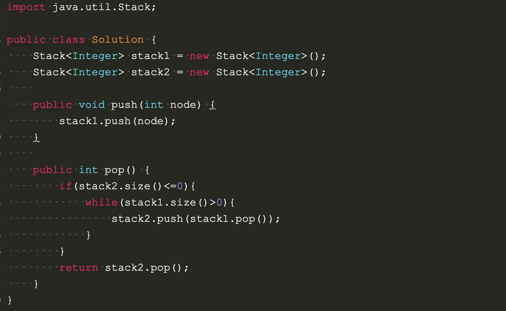

# Implement the push and pop methods of a queue by making use of two stacks

## method:
queue is first in first out, while stack is first in last out. By making use of two stacks, one for push, and when trying to pop from this queue, making all the elements to the other stack so that all elements are in the reverse order, so that it will pop the first element in the queue.

## Code:
[Main](https://github.com/boyuandong/JavaAlogrithm-/blob/master/Code/StackToQueue/src/Main.java)

[MyQueue](https://github.com/boyuandong/JavaAlogrithm-/blob/master/Code/StackToQueue/src/MyQueue.java)

